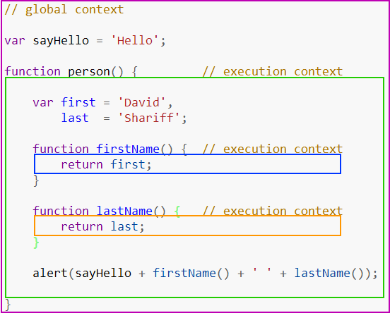

# 对Javascript执行上下文和执行栈的理解

## 执行上下文的类型

- 全局执行上下文：只有一个，浏览器中的全局对象就是 window 对象，this 指向这个全局对象
- 函数执行上下文：存在无数个，只有在函数被调用的时候才会被创建，每次调用函数都会创建一个新的执行上下文
- Eval 函数执行上下文： 指的是运行在 eval 函数中的代码，很少用而且不建议使用
  :::info
  eval() 是 JavaScript 中的一个全局函数，它可以接收一个字符串作为参数，并将这个字符串解析为 JavaScript 代码并执行。当调用 eval() 函数时，JavaScript 引擎会为其创建一个特殊的执行上下文，称为 Eval 函数执行上下文。
  :::
  

:::details
紫色框住的部分为全局上下文，蓝色和橘色框起来的是不同的函数上下文。只有全局上下文（的变量）能被其他任何上下文访问

可以有任意多个函数上下文，每次调用函数创建一个新的上下文，会创建一个私有作用域，函数内部声明的任何变量都不能在当前函数作用域外部直接访问
:::

**关于 JavaScript 全局环境中的 let 和 const 变量为何不会挂载到 window 对象上。**

:::details
在 JavaScript 代码执行时，会创建全局执行上下文（Global Execution Context），它包含：

全局对象环境（Object Environment, objEnv）：用于存储 var 声明的变量和 function 声明的函数，这部分变量会被挂载到 window 对象上。

全局词法环境（Declarative Environment, declsEnv）：用于存储 let 和 const 变量，它们不会被添加到 window 对象。
全局环境是双环境（dual environment），即：
GlobalEnv = objEnv + declsEnv

var 和 function 声明的变量属于 objEnv，因此可通过 window 访问。

let 和 const 声明的变量属于 declsEnv，不会附加到 window。
:::

## 执行上下文的生命周期

**分为三个阶段：创建、执行、回收**

### 创建阶段

:::tip
这里需要区分几个概念
:::

#### 词法环境

**词法环境是 JavaScript 解析代码时用来存储变量、函数声明及作用域链的信息的结构。**

它由两个部分组成：

- 环境记录（Environment Record）：存储变量和函数声明的地方。

- 外部词法环境引用（Outer Lexical Environment Reference）：用于指向外层的词法环境，形成作用域链。

分类：

全局环境：

- this 绑定到全局对象，浏览器环境是 windows，Node.js 环境是 global
- 环境记录里存储变量和函数声明
- 外部词法环境引用为 null，因为他没有外部环境，已经是最外层了

函数环境

- 存储函数内部的变量、参数和函数声明。
- 外部词法环境指向创建该函数的词法环境（即父作用域）。

块级环境

- 由 let 和 const 声明的变量存储在这里，而 var 声明的变量不会受块级作用域限制（仍然属于 Variable Environment）。
- 在 if、for 等块级作用域中起作用。
- 外部词法环境指向封闭该块的作用域。

#### 变量环境

**包含上述词法环境的所有属性，主要区别是它专门存储 var 变量声明。**

**举个例子**

```JavaScript
let a = 20;
const b = 30;
var c;

function multiply(e, f) {
 var g = 20;
 return e * f * g;
}

c = multiply(20, 30);
```

上述代码的执行上下文为：

```JavaScript
GlobalExectionContext = {

  ThisBinding: <Global Object>,

  LexicalEnvironment: {  // 词法环境
    EnvironmentRecord: {
      Type: "Object",
      // 标识符绑定在这里
      a: < uninitialized >,
      b: < uninitialized >,
      multiply: < func >
    }
    outer: <null>
  },

  VariableEnvironment: {  // 变量环境
    EnvironmentRecord: {
      Type: "Object",
      // 标识符绑定在这里
      c: undefined,
    }
    outer: <null>
  }
}

FunctionExectionContext = {

  ThisBinding: <Global Object>,

  LexicalEnvironment: {
    EnvironmentRecord: {
      Type: "Declarative",
      // 标识符绑定在这里
      Arguments: {0: 20, 1: 30, length: 2},
    },
    outer: <GlobalLexicalEnvironment>
  },

  VariableEnvironment: {
    EnvironmentRecord: {
      Type: "Declarative",
      // 标识符绑定在这里
      g: undefined
    },
    outer: <GlobalLexicalEnvironment>
  }
}
```

:::tip
var 声明变量和函数放在变量环境中
:::

:::warning
这里也展示了变量提升的原理，你发现了嘛
:::

没错！在执行上下文创建阶段 var 声明的变量存储到变量环境中为 undefined，而 let、const 声明变量则是 **uninitialized**，在生命周期执行阶段才会检查是否存在值从而进行变量赋值

### 执行阶段

在这阶段，执行变量赋值、代码执行

如果 Javascript 引擎在源代码中声明的实际位置找不到变量的值，那么将为其分配 undefined 值

### 回收阶段

执行上下文出栈等待虚拟机回收执行上下文

## 执行栈

当 Javascript 引擎开始执行你第一行脚本代码的时候，它就会创建一个全局执行上下文然后将它压到执行栈中

每当引擎碰到一个函数的时候，它就会创建一个函数执行上下文，然后将这个执行上下文压到执行栈中

引擎会执行位于执行栈栈顶的执行上下文(一般是函数执行上下文)，当该函数执行结束后，对应的执行上下文就会被弹出，然后控制流程到达执行栈的下一个执行上下文

举个例子

```JavaScript
let a = 'Hello World!';
function first() {
  console.log('Inside first function');
  second();
  console.log('Again inside first function');
}
function second() {
  console.log('Inside second function');
}
first();
console.log('Inside Global Execution Context');
```


简单分析一下流程：

- 创建全局上下文请压入执行栈
- first 函数被调用，创建函数执行上下文并压入栈
- 执行 first 函数过程遇到 second 函数，再创建一个函数执行上下文并压入栈
- second 函数执行完毕，对应的函数执行上下文被推出执行栈，执行下一个执行上下文 first 函数
- first 函数执行完毕，对应的函数执行上下文也被推出栈中，然后执行全局上下文
- 所有代码执行完毕，全局上下文也会被推出栈中，程序结束
