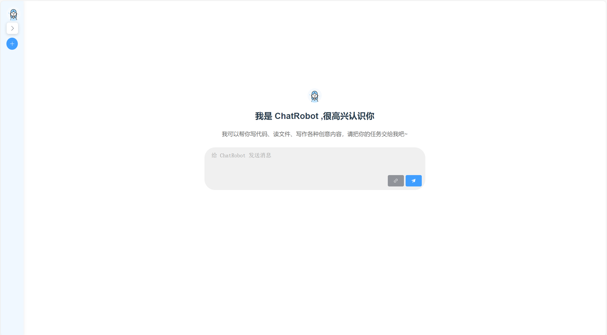
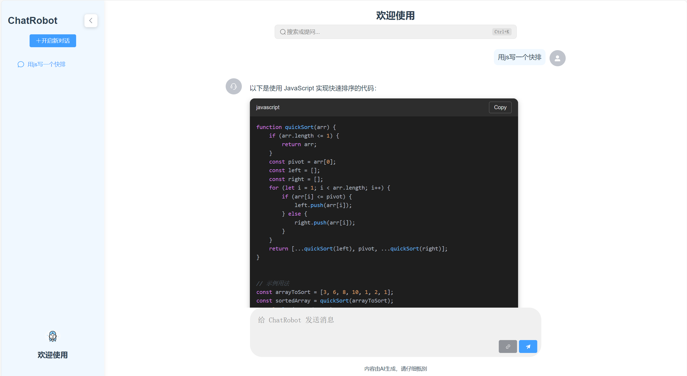
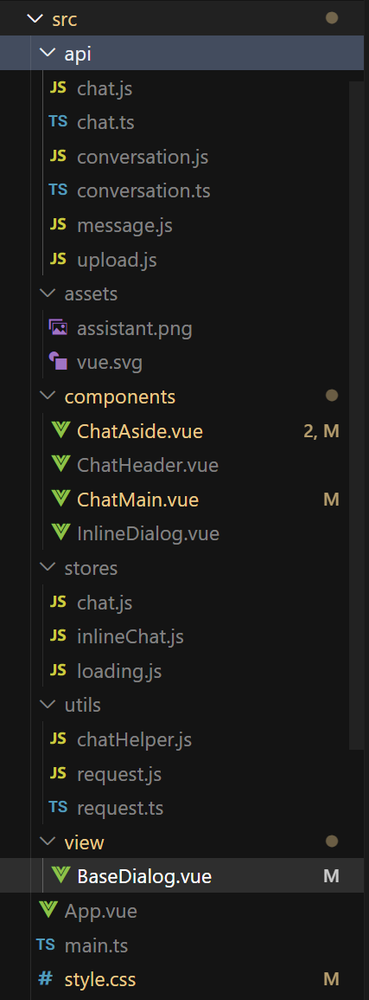

## AiDialog项目功能介绍

为了详细介绍各个代码的实现流程，我们可以从项目的主要组件和功能模块入手，逐步分析每个部分的实现细节。

### 项目展示

### 目录结构

### 1. 用户界面

#### 1.1 侧边栏（`ChatAside.vue`）

- **功能**：显示聊天列表，控制侧边栏的展开/收起状态。
- **实现流程**：
  - 使用`<el-aside>`组件创建侧边栏，绑定`isCollapsed`属性控制展开/收起状态。
  - 使用`<el-menu>`组件展示聊天记录列表，`v-for`指令遍历`chatList`数组生成菜单项。
  - 通过`handleToggleCollapse`方法切换侧边栏状态，使用`emit`触发父组件事件。
  - 使用`localStorage`保存和加载聊天记录，`watch`监听`chatList`变化并更新存储。

#### 1.2 聊天头部（`ChatHeader.vue`）

- **功能**：显示当前聊天的标题。
- **实现流程**：
  - 使用`<el-header>`组件创建头部，显示固定标题或动态标题。
  - 通过`useChatStore`获取聊天状态，动态显示当前聊天的标题。

#### 1.3 聊天主体（`ChatMain.vue`）

- **功能**：显示聊天内容和输入区域。
- **实现流程**：
  - 使用`<el-main>`组件创建聊天主体，包含聊天记录和输入区域。
  - 使用`<el-scrollbar>`组件实现滚动区域，`v-for`指令遍历`store.messages`数组生成消息项。
  - 通过`sendMessage`方法发送消息，调用`emit`触发父组件事件。
  - 监听`store.messages`变化，使用`nextTick`确保滚动到底部。

#### 1.4 内联对话框（`InlineDialog.vue`）

- **功能**：快速搜索和提问。
- **实现流程**：
  - 使用`
`创建对话框，绑定`isExpanded`和`isChatting`状态控制显示形态。
  - 通过`expandDialog`和`closeDialog`方法控制对话框的展开和关闭。
  - 使用`sendMessage`方法发送消息，调用`ChatHelper`类处理消息。

### 2. 数据管理

#### 2.1 状态管理（`Pinia`）

- **功能**：管理聊天消息的状态。
- **实现流程**：
  - 使用`defineStore`定义`chat`状态，包含`messages`数组和`$reset`方法。
  - 在各个组件中通过`useChatStore`获取和更新聊天状态。

#### 2.2 本地存储

- **功能**：保存聊天记录。
- **实现流程**：
  - 在`ChatAside.vue`中使用`localStorage`保存和加载`chatList`。
  - 通过`watch`监听`chatList`变化，自动更新存储。

### 3. 文件处理

#### 3.1 文件上传（`upload.js`）

- **功能**：处理文件上传到服务器。
- **实现流程**：
  - 使用`fetch` API 发送 POST 请求，将文件上传到服务器。
  - 处理上传成功和失败的响应，更新`uploadedFileInfo`状态。

#### 3.2 文件显示

- **功能**：在聊天记录中显示上传的文件信息。
- **实现流程**：
  - 在`ChatMain.vue`中，`v-for`指令遍历`message.files`数组生成文件项。
  - 显示文件名和大小，提供删除文件的按钮。

### 4. 消息处理

#### 4.1 消息发送与接收（`chatHelper.js`）

- **功能**：处理用户消息的发送和助手回复的接收。
- **实现流程**：
  - `handleChatMessage`方法处理消息发送，调用`createChat`或`createConversation` API。
  - `handleStreamResponse`方法处理流式响应，实时更新助手的回复内容。

#### 4.2 流式响应处理

- **功能**：实时更新助手的回复内容。
- **实现流程**：
  - 在`handleStreamResponse`方法中，使用`TextDecoder`解析流式响应。
  - 逐行处理响应数据，更新`store.messages`中的助手消息内容。

### 5. 快捷键支持

- **功能**：通过快捷键快速打开搜索对话框。
- **实现流程**：
  - 在`InlineDialog.vue`中，`onMounted`生命周期钩子中监听全局键盘事件。
  - 支持`Ctrl+K`快捷键打开对话框，`Escape`键关闭对话框。

通过以上详细的实现流程分析，可以更好地理解项目的各个功能模块是如何协同工作的。
